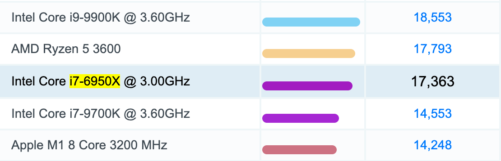
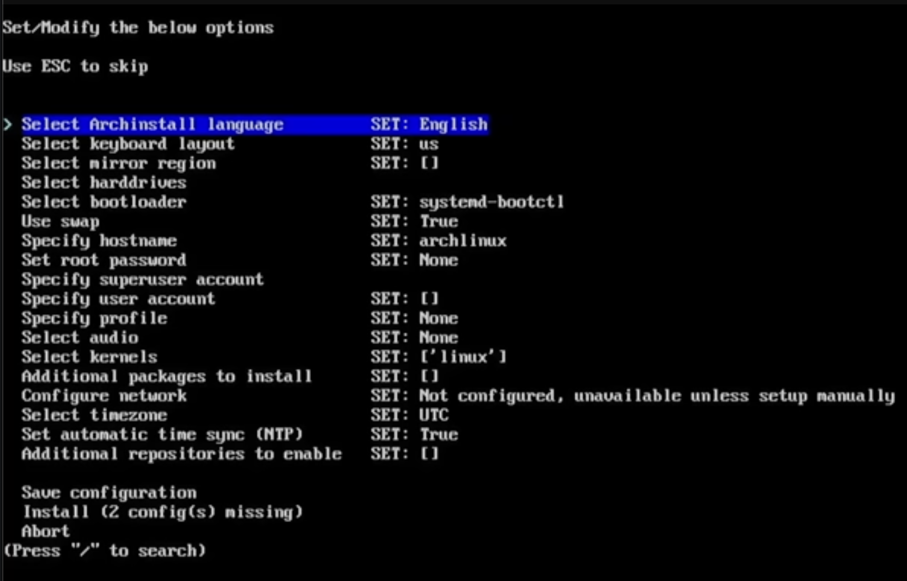
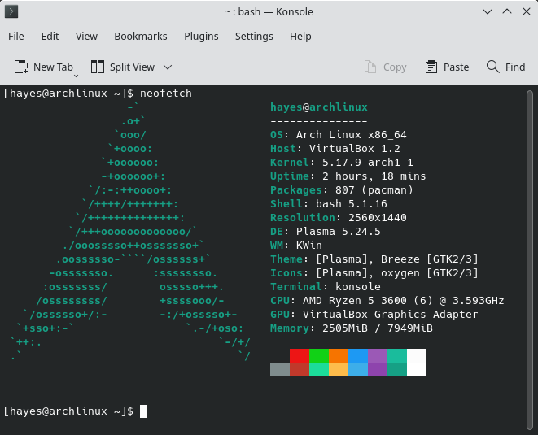

# i use arch btw

---

# Why run Arch btw?

* Windows telemetry is the worst that it has ever been:
  [Has Windows become Spyware? -- The PC Security Channel](https://www.youtube.com/watch?v=IT4vDfA_4NI)
    * Spoiler: All of the DNS entries that have "privacy" in the domain aren't actually privacy focused
* You don't really know what is installed on your computer
* Enjoy the satisfaction of saying "i use arch btw"

---

# The real reason...

Microsoft decided *that your processor sucks*.




---

# Installation

The [Arch Installation Guide](https://wiki.archlinux.org/title/installation_guide) is the best resource to get started.

* Follow step by step instructions
* Boot doesn't work; Read steps again
* Forget to install sudo and you deleted the root user
* Look up [youtube tutorial](https://www.youtube.com/watch?v=G-mLyrHonvU) on how to install Arch
* Give up on manual installation after finding `archinstall` comes with the install media

---



---

# Post on /r/archlinux

```bash
# (s) Sync
# (y) Refresh Package Cache
# (u) Upgrade packages
$ pacman -Syu neofetch

$ neofetch
$ neofetch
$ neofetch
$ neofetch
$ neofetch
$ neofetch
$ neofetch
$ neofetch
$ neofetch
$ neofetch
```



---

# But I want to play video games!

* Get Battle.net to install Overwatch 2 with [UseBottles]()
* Run the launcher the following day to find that Blizzard updated their launcher and broke 10+ years of Wine compatibility
* Make a pull request to `usebottles/components` to update the configurations to support a bleeding edge version of Wine
* Find there's a typo in `PULL_REQUEST_TEMPLATE.md` and submit another PR.
* Update UseBottles with the new changes, everything works great!

---

# A few months later

* Read through the Wiki again and start understanding how `archinstall` works
* Read through the Wiki for btrfs for the copy-on-write feature
* Discover that archinstall uses shell commands to interface with multiple commands that each have a small subset of information about the filesystem.
* Shave the yak...
> How hard can it be to write a C extension for Python to interface with all the C libraries like `libblkid`?

---

# Summary

* Submitting pull requests for projects designed for simplifying other peoples' installations is very satisfying
* Realized a Linux distribution is nothing more than a bunch of software packages relying on common interface implementations
* Tricked myself into learning what every package on the filesystem does
* All problems are debuggable when you know the package name reported in `dmesg`
* It is fun writing `pacman` in your terminal